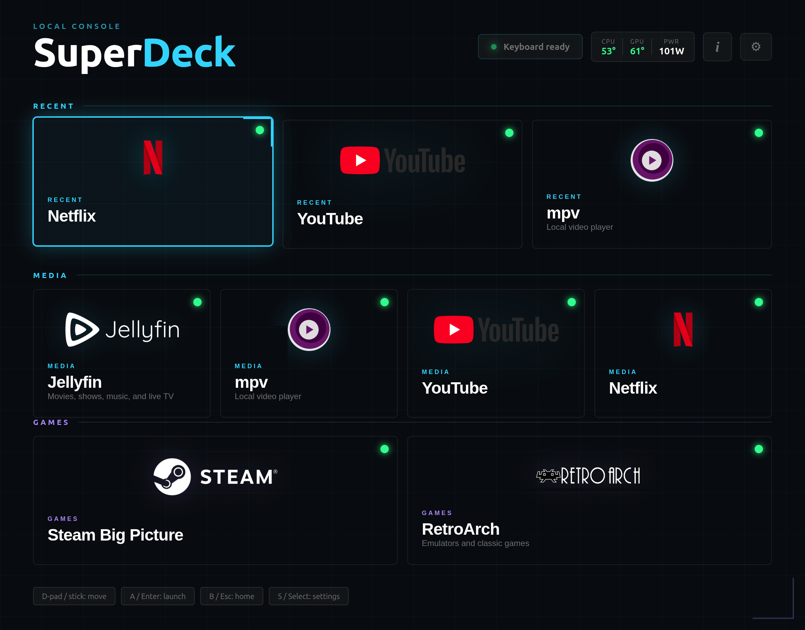

# SuperDeck

A local Linux console shell for a living-room media box. The backend is Python
and FastAPI. The frontend is a TV-style app launcher with keyboard and Xbox
controller navigation.



## Run

Bootstrap a fresh Linux checkout:

```bash
scripts/bootstrap-new-system.sh
```

That installs Linux packages, syncs the Python environment with `uv`, and
installs the controller profile. To also install Jellyfin, create a user
service, and add a desktop kiosk launcher:

```bash
scripts/bootstrap-new-system.sh --include-jellyfin --enable-user-service --install-kiosk
```

Manual Python-only setup:

```bash
uv sync
```

Install Linux system dependencies:

```bash
scripts/install-system-deps.sh
```

Install Jellyfin server as well:

```bash
scripts/install-system-deps.sh --include-jellyfin
```

Start the server:

```bash
uv run superdeck
```

Open:

```text
http://127.0.0.1:8085
```

## Controls

- Arrow keys or controller D-pad / left stick move focus.
- Enter or controller A launches the selected app.
- Escape or controller B returns focus to the first tile.

## System Dependencies

Python dependencies are managed by `uv`. Media apps such as Chromium, mpv,
Steam, and RetroArch are system packages and must exist on the Linux host.

Check what the backend can find:

```bash
curl http://127.0.0.1:8085/api/dependencies
```

Check whether the backend can see your graphical desktop session:

```bash
curl http://127.0.0.1:8085/api/session
```

Check service state for Jellyfin:

```bash
curl http://127.0.0.1:8085/api/services
```

Install the default dependency set:

```bash
scripts/install-system-deps.sh
```

The installer supports `apt-get`, `dnf`, `pacman`, and `zypper`. Package names
can vary by distribution. If a package is unavailable, install it with your
distribution's normal method and update `superdeck/config/apps.yaml` if the
executable name differs.

On apt-based systems, third-party repository errors can stop installation before
any packages are installed. If `apt-get update` reports a missing signing key,
fix or disable that repository first, then rerun the installer. For example, the
packages were not installed if the log ends with:

```text
E: The repository '<repo>' is not signed.
```

If launching an app reports that an executable is missing, either install that
program or change the command in `superdeck/config/apps.yaml`.

If a third-party apt repository is broken but your package cache is already
usable, install from the current cache:

```bash
scripts/install-system-deps.sh --skip-apt-update
```

Or continue after apt update errors:

```bash
scripts/install-system-deps.sh --ignore-apt-update-errors
```

The better long-term fix is still to repair or disable the broken apt source.

## Configure Apps

Edit `superdeck/config/apps.yaml`.

Supported app kinds:

- `web`: launches Chromium from the backend in fullscreen app mode.
- `command`: launches a local process from the backend.

Apps default to `requires_display: true`. That is correct for Chromium, Steam,
RetroArch, and mpv because they need access to your desktop session. Set it to
`false` only for background commands that do not open windows.

Web apps default to `require_reachable: true`. SuperDeck checks the app URL
before opening Chromium, so a stopped Jellyfin service reports a launcher error
instead of opening a browser error page. Set `health_url` when the app should be
checked through a different endpoint, or set `require_reachable: false` to always
open the browser.

Example:

```yaml
apps:
  - id: jellyfin
    name: Jellyfin
    kind: web
    category: Media
    description: Movies, shows, music, and live TV
    url: http://localhost:8096
    health_url: http://localhost:8096

  - id: steam
    name: Steam Big Picture
    kind: command
    category: Games
    description: Controller-first PC gaming
    command: env STEAM_BIG_PICTURE_MODE=tenfoot ./scripts/launch-steam-big-picture.sh
```

## Chromium Launching

Web apps are launched by the backend with Chromium:

```bash
chromium --new-window --start-fullscreen --user-data-dir=/tmp/superdeck-chromium --app=<url>
```

Override the Chromium command with environment variables:

```bash
SUPERDECK_CHROMIUM_BIN=chromium
SUPERDECK_CHROMIUM_PROFILE=/tmp/superdeck-chromium
SUPERDECK_CHROMIUM_ARGS="--ozone-platform=wayland"
```

Launch stdout/stderr is written to:

```text
/tmp/superdeck-launch.log
```

If a tile says it started but no window appears, check `/api/session` and that
log file. The usual cause is that SuperDeck was started outside the logged-in
graphical session.

## Jellyfin

The default Jellyfin tile expects the Jellyfin server to be running at:

```text
http://localhost:8096
```

Check it directly:

```bash
curl -I http://localhost:8096
```

If it is installed as a system service, start it with:

```bash
sudo systemctl enable --now jellyfin
```

Install Jellyfin automatically on Debian, Ubuntu, and derivatives such as Linux
Mint:

```bash
scripts/install-jellyfin.sh
```

This downloads Jellyfin's official Debian/Ubuntu install script, verifies its
published SHA-256 checksum, runs it with `sudo`, and enables the `jellyfin`
service.

If Jellyfin is running on another machine, change the `url` and `health_url`
fields in `superdeck/config/apps.yaml`.

## Steam Big Picture

The Steam tile uses:

```bash
scripts/launch-steam-big-picture.sh
```

The launcher restarts an already-running Steam client, then starts Steam with:
The Steam tile starts Steam in `tenfoot` mode:

```bash
STEAM_BIG_PICTURE_MODE=tenfoot scripts/launch-steam-big-picture.sh
```

The script's default mode starts Steam normally, waits briefly, then asks Steam to open
Big Picture through the Steam browser protocol:

```bash
steam steam://open/bigpicture
```

This is less invasive than forcing CEF flags at process startup and tends to
avoid Steam Deck UI infinite loading screens.

You can test alternate modes:

```bash
STEAM_BIG_PICTURE_MODE=tenfoot scripts/launch-steam-big-picture.sh
STEAM_BIG_PICTURE_MODE=cef-workaround scripts/launch-steam-big-picture.sh
```

`tenfoot` starts Steam with `-tenfoot -cef-force-gpu`. `cef-workaround` also
adds `-no-cef-sandbox`, but use that only when needed because it can trade one
CEF issue for another.

Also check Steam's UI setting:

```text
Steam > Settings > Interface > Enable GPU accelerated rendering in web views
```

## Linux Boot

Use the user service when the backend needs to launch graphical apps. It starts
inside the logged-in desktop session, so Chromium, Steam, RetroArch, and mpv get
the same display/session environment they expect.

The bootstrap script generates a systemd user service with paths for the current
checkout:

```bash
scripts/bootstrap-new-system.sh --enable-user-service
```

It writes `~/.config/systemd/user/superdeck.service`, starts it, and enables
linger for the user when `loginctl` is available.

For a desktop kiosk session, let the bootstrap script install the autostart
launcher:

```bash
scripts/bootstrap-new-system.sh --install-kiosk
```

The `deploy/mediaserver.service` file is retained as a manual API-only system
service example. It is not the best choice for launching graphical apps because
system services usually do not have the user's display/session environment.

```bash
sudo cp deploy/mediaserver.service /etc/systemd/system/superdeck.service
sudo systemctl daemon-reload
sudo systemctl enable --now superdeck.service
```
